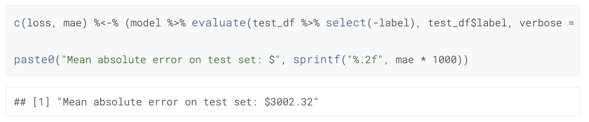
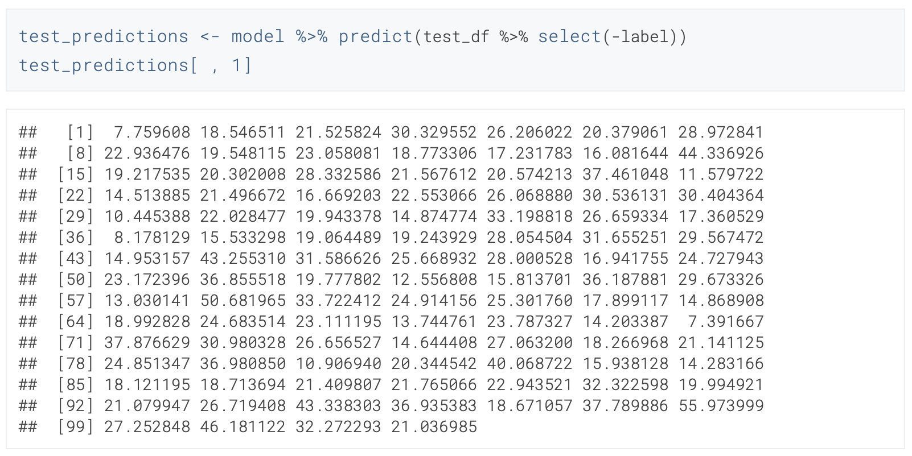
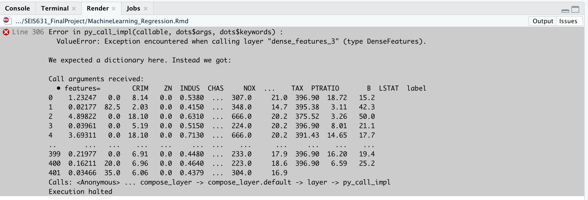
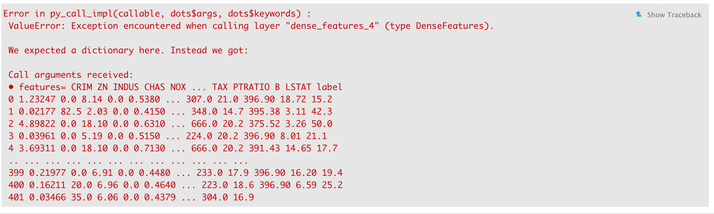

```{r setup, include=FALSE}
knitr::opts_chunk$set(echo = TRUE)
```

# Introduction

## What

For my final project I am exploring Machine Learning libraries for R. One that I have used before with Python is TensorFlow. Another option that I found in my research is called caret. Below you will find a run-through of an example of regression machine learning model done using the Keras add-on for TensorFlow. Going through each step of the process, I have explained what is happening and why it is important.

## Why

It is my goal to become a Machine Learning Specialist as I continue down my Data Science career. As such, I feel it's best to be able to teach yourself a concept and be able demonstrate my understanding by showing others how to do the same. Starting at the baseline with an example provided in the documentation of a machine learning library will allow me to not only to be able to code the model, but also be able to process how it works. This will help me in the future when approaching various datasets to be able to identify which model/algorithm might be best to use for the inclined result.

## How

While reading the documentation on TensorFlow and researching the caret library I found a few examples showing simple regression models. I felt it was best for me to follow what was shown, run each code block, and then explain the purpose behind that step. I chose stick to TensorFlow due to my familiarity. I also researched machine learning as broader topic as I feel it's a phrase that is brought up often, but few comprehend what it truly is. I paraphrased what I found to be easy to digest and given an example of each type of machine learning so one can quickly identify where they might come into play. This should help set the foundation for some of the concepts seen in the regression example walk-through.

# Body

## Machine Learning Research

Machine Learning is offset of Artificial Intelligence where models based on algorithms are create for the purpose of predicting future outcomes. It is able to do this learning from historical data, often referred to as training. There are 4 different types of machine learning: **Supervised**, **Unsupervised**, **Semi-Supervised**, and **Reinforcement**.

**Supervised learning** is when algorithms are trained on both input and desired output data. This training data must be labeled and the algorithm is provided the variables on which to determine correlation. This branch of machine learning is primarily used for classification and regression modeling. Think your email inbox, does it automatically filter for spam or junk emails? This is an example of supervised learning using classification.

**Unsupervised learning** only takes input data -- most likely this data is unstructured, meaning it is not labeled or classified. The algorithms train on this data to create structure, this is generally done through clustering and/or finding anomalies. The main concept behind this type of modeling is something we learning in class: probability density function. Biologists may use this type of machine to analyze DNA clusters while studying evolution.

**Semi-Supervised learning** intuitively combines aspects of supervised and unsupervised learning. The algorithm is supplied with a labeled dataset to train on allowing it to use the model on a new, unlabeled dataset and apply the dimensions it learning. It has been found that this combo of using labeled and unlabled data creates the most accuracy. An example of when semi-supervised learning might be use is for fraud detection or language translation.

**Reinforcement learning** is where the algorithm is programmed to have a goal with positive consequences for achieving it or negative for not. Game theory implemented with code. I believe this where AI really comes into play, as this the type of machine learning used for robotics or video games. It's the computer chess player against you or the technology likely fueling Telsas in their driver-less functions.

## Machine Learning in Action

Now that we have a base understand of machine learning, let's dive into an example. I will be running through a regression model using TensorFlow library and it's accompanying datasets. Through each step, I will explain what is going in that code block and why it is being done. Code is copied directly from https://tensorflow.rstudio.com/tutorials/beginners/basic-ml/tutorial_basic_regression/ with some additions of my own or slight changes.

For those who may want to follow along, I'll begin by showing the libraries needed to be installed:
```{r, eval=FALSE}
install.packages("tensorflow")
install_tensorflow()
install.packages("tfdatasets")
install.packages("keras")
install_keras()
```

Now that we have the libraries installed, let's do a quick check to make sure:
```{r, message=FALSE, warning=FALSE}
library(tensorflow)
library(tfdatasets)
library(keras)
# The following libraries were not explicitly installed above as most likely you
#already have it from when we installed tidyverse in class
library(dplyr)
library(ggplot2)
```

Alright, Machine Learning, here we come!
```{r}
# This dataset is available in the keras/tfdatasets packages:
boston_housing <- dataset_boston_housing()
#boston_housing
# Wanted to show the data, but it is too big and takes up too much space in the
# pdf file
# Adjusting to show what's in this dataframe
dimnames.data.frame(boston_housing)
names(boston_housing$train)
names(boston_housing$test)
```

```{r}
head(boston_housing$train$x)
```

```{r}
head(boston_housing$train$y)
```

```{r}
head(boston_housing$test$x)
```

```{r}
head(boston_housing$test$y)
```


Looking at the dataset, we see it is already broken in to *train* and *test*, each with an x and y and the x dataframes have 13 columns. If you remember from the description of Supervised learning above, we train the algorithm on input data and the desired output, the *train* set will has both the input and the desired output. Then *test* data will be what we run the model on to see how it performs. So let's move on and assign their variables:

```{r}
c(train_data, train_labels) %<-% boston_housing$train
c(test_data, test_labels) %<-% boston_housing$test
paste0("Training entries: ", length(train_data), ", labels: ", length(train_labels))
paste0("Testing entries: ", length(test_data), ", labels: ", length(test_labels))
```

We assigned the variables to their own vectors where the x are the entries (%_data) and y are the labels (%_labels). From there, using the concatenate function we are able to see how many examples we are training on (404) and how many we are testing on (102). When doing machine learning, you always want to have as much data as possible to train on, this allows for the model to be as accurate as possible, from there when running a supervised learning algorithm you also want provide a significant amount of data to test on, this will allow for enough points for the regression to be effective.

Now, let's start to understand this data. For this part, I'm copying and pasting from the TensorFlow for R Tutorial page (https://tensorflow.rstudio.com/tutorials/beginners/basic-ml/tutorial_basic_regression/)

"The dataset contains 13 different features:
* Per capita crime rate.
* The proportion of residential land zoned for lots over 25,000 square feet.
* The proportion of non-retail business acres per town.
* Charles River dummy variable (= 1 if tract bounds river; 0 otherwise).
* Nitric oxides concentration (parts per 10 million).
* The average number of rooms per dwelling.
* The proportion of owner-occupied units built before 1940.
* Weighted distances to five Boston employment centers.
* Index of accessibility to radial highways.
* Full-value property-tax rate per $10,000.
* Pupil-teacher ratio by town.
* 1000 * (Bk - 0.63) ** 2 where Bk is the proportion of Black people by town.
* Percentage lower status of the population."

Now that we know what the columns are, let's add their names so examining the data makes a little more sense:

```{r}
column_names <- c('CRIM', 'ZN', 'INDUS', 'CHAS', 'NOX', 'RM', 'AGE', 
                  'DIS', 'RAD', 'TAX', 'PTRATIO', 'B', 'LSTAT')

train_df <- train_data %>% 
  as_tibble(.name_repair = "minimal") %>% 
  setNames(column_names) %>% 
  mutate(label = train_labels)

test_df <- test_data %>% 
  as_tibble(.name_repair = "minimal") %>% 
  setNames(column_names) %>% 
  mutate(label = test_labels)
```

Before we take a look at the top few rows of the dataframe, let's go over what we did in the above code chunk. First, we created a new variable and name it %_df, this variable is taking the %_data part of the combined vector we constructed earlier and converting it to a dataframe using the as_tibble() function. Within this function, we clarify to not check the names of the columns using .name_repair = "minimal". This is being done since the original data doesn't have column names and we are assigning them now using the setNames() function, here we are pulling the array for the column names built in the first line of the code block. Finally, we are adding a 14th column to this dataframe with the column name 'label' which is populated with y of the train/test data or what we called %_labels. So now we have two new dataframes, let's peek at them:

```{r}
head(train_df)
head(test_df)
```

Alright, looking the data now is much easier on the eyes, plus since we are doing a regression model machine learning algorithm, we know it is considered supervised learning and therefore needed to be labeled. However while looking at this data as well, you will notice that all the columns have values in various scales. The CHAS column is a binary indicator for the Charles River, the RAD and TAX columns also seem to be integers, and most other columns are doubles or floats. You can run the model with the data as is, but it is best practice to normalize the values so they are all on the same scale range.

```{r}
spec <- feature_spec(train_df, label ~ . ) %>% 
  step_numeric_column(all_numeric(), normalizer_fn = scaler_standard()) %>% 
  fit()

spec
```

Amazing how far we've made it. It's finally time to build the model now that we have normalized the data.
```{r}
input <- layer_input_from_dataset(train_df %>% select(-label))

output <- input %>% 
  layer_dense_features(dense_features(spec)) %>% 
  layer_dense(units = 64, activation = "relu") %>%
  layer_dense(units = 64, activation = "relu") %>%
  layer_dense(units = 1) 

model <- keras_model(input, output)

summary(model)
```

Now that we have the model, let's use the compile() function so it is configured for training. We are using the loss = "mse" which stands for mean squared error since we are running a regression model and not a classification one. In the Keras documenation, you can read about the details of this part of the function (https://keras.io/api/callbacks/). Our metric for evaluation is mean absolute error (mae). The optimizer chosen is the one recommended for recurrent neural networks and we have left the learning rate as default (https://tensorflow.rstudio.com/reference/keras/optimizer_rmsprop/).

```{r}
model %>% 
  compile(
    loss = "mse",
    optimizer = optimizer_rmsprop(),
    metrics = list("mean_absolute_error")
  )
```

From here, let's combine the above two steps into a single function as we will need to use as we train the algorithm and play around with the iterations to ensure it's as accurate as possible:

```{r}
build_model <- function() {
  input <- layer_input_from_dataset(train_df %>% select(-label))
  
  output <- input %>% 
    layer_dense_features(dense_features(spec)) %>% 
    layer_dense(units = 64, activation = "relu") %>%
    layer_dense(units = 64, activation = "relu") %>%
    layer_dense(units = 1) 
  
  model <- keras_model(input, output)
  
  model %>% 
    compile(
      loss = "mse",
      optimizer = optimizer_rmsprop(),
      metrics = list("mean_absolute_error")
    )
  
  model
}
```

It's now time to train the model. Within Keras there is a Callbacks object the purose of which is to "perform actions at various stages of training" (https://keras.io/api/callbacks/). In our first attempt to train the model, we will create a custom callback setting a dot as the output for each iteration through the x and y data. Keras calls these iterations epochs and we will be running 500 of them for this training.

```{r}
# Display training progress by printing a single dot for each completed epoch.
print_dot_callback <- callback_lambda(
  on_epoch_end = function(epoch, logs) {
    if (epoch %% 80 == 0) cat("\n")
    cat(".")
  }
)    

model <- build_model()

history <- model %>% fit(
  x = train_df %>% select(-label),
  y = train_df$label,
  epochs = 500,
  validation_split = 0.2,
  verbose = 0,
  callbacks = list(print_dot_callback)
)
```

Just running the model and seeing the output of .'s isn't very informative. To understand what impact this training had, it would be best to see it plotted out.

```{r}
plot(history)
```
From these graphs we can see lines are flat after about 150/200 epochs, this indicates no improvement in the model training. This can be adjusted by using a different callback() function - callback_early_stopping(). In this we are setting it to monitor the loss and the patience = 20 tells the model to stop running after 20 epochs of no improvement. Let's re-train the model and plot the results:

```{r}
# The patience parameter is the amount of epochs to check for improvement.
early_stop <- callback_early_stopping(monitor = "val_loss", patience = 20)

model <- build_model()

history <- model %>% fit(
  x = train_df %>% select(-label),
  y = train_df$label,
  epochs = 500,
  validation_split = 0.2,
  verbose = 0,
  callbacks = list(early_stop)
)

plot(history)
```
According to these graphs the average error is ~$2,500. Can we get a number to confirm?

```{r}
c(loss, mae) %<-% (model %>% evaluate(train_df %>% select(-label), train_df$label, verbose = 0))

paste0("Mean absolute error on train set: $", sprintf("%.2f", mae * 1000))
```


Let's compare this to what the model evaluates on the test dataset:

```{r}
c(loss, mae) %<-% (model %>% evaluate(test_df %>% select(-label), test_df$label, verbose = 0))

paste0("Mean absolute error on test set: $", sprintf("%.2f", mae * 1000))
```

Looking at the number I got for MAE is 3551.23, however on the TensorFlow tutorial page they show 3002.32:



I wonder if this is because I did not normalize the test data. Let's try doing that and then re-running the above code block to see what happens:

```{r}
spec2 <- feature_spec(test_df, label ~ . ) %>% 
  step_numeric_column(all_numeric(), normalizer_fn = scaler_standard()) %>% 
  fit()

spec2
```

```{r}
c(loss, mae) %<-% (model %>% evaluate(test_df %>% select(-label), test_df$label, verbose = 0))

paste0("Mean absolute error on test set: $", sprintf("%.2f", mae * 1000))
```

I am still getting the same result. This could be that data in the dataset has changed since they posted their tutorial. Or maybe I missed something else. This might be something I might need to dig into to solve the mystery. Either way, looking at these MAE values compared to some of the errors under the label column going up to $15,000, they are not as significant.

Since the purpose of most machine learning is predictive modeling, let's generate some predictions based on the model we have now trained:

```{r}
test_predictions <- model %>% predict(test_df %>% select(-label))
test_predictions[ , 1]
```

Again, my numbers are just slightly off from the tutorial:



However, we have successfully run through an example of a regression supervised machine learning model! From here, I would be curious to try this dataset using the caret package and see what the differences are and if one is easier or the numbers change as well.

# Topics from Class

## R/R Markdown

During this project I learned a lot about R and R Markdown. While working through the code for the machine learning algorithm, I learned the following in R: %in% operator, paste0(), mutate(), as_tibble(), and how to write a function in R. With regards to R Markdown, I learned how to create bullet points, insert an image, and also dealt with new errors I hadn't seen before when attempting to knit my file. I was able to resolve the error by commenting out the code that was causing the error (see below), however, I was expecting the R Markdown file to print the error into the knitted PDF. 



## Github

I have worked with Github before both academically and professionally, so I felt comfortable using it for this project. I did learn how to clone a repo and add/commit/push using R Studio. While I think it's a unique feature, I prefer to use the terminal, so I did primarily use that rather than the inbuilt R Studio buttons. I also have my SSH set up for my Github profile, so when cloning the repo into R Studio and playing around with the Git capabilities in R Studio, those permissions were cleared on my computer and I had to reset the agent. 

## Regression

We've been studying regression during the last few weeks of class which is why I chose to do it as my machine learning example. I do feel it's important to have a base knowledge about regression and other statistical theories and equations prior to diving into machine learning as those are foundations for these algorithms, so it allows you know what is going on when the model is training on the data and where the predictive numbers come from. However, you don't get exposed to the actual equation, so in that sense, I felt a bit removed from the textbook and lectures we've done.

## Machine Learning

I am very interested in machine learning and hope to center my career around it going forward so for me it was very important to get a feel for it in R. There have been Data Scientist positions that I haven't applied for as I didn't know R that well and therefore certainly didn't feel confident learning the existing machine learning techniques of a company. Now, I can comfortable code in R and through this project exhibited my ability to understand the models so I can apply them in future scenarios.

## R Libraries/Packages

Throughout class we've been touching on some inbuilt R libraries and diving into others that needed to be installed such as LaTex and Tidyverse. I wanted to see what more was out there. In the future I might deep dive into an R versus Python comparison to see what the equivalent libraries are between the two. And as I found TensorFlow for R, I'm thinking there are more libraries that have been made compatible with R or libraries originally created for R that may have been adjusted to be imported by Python. Through running the code in this project, I also better understood the ones we've used in class such as ggplot2.

# Conclusion

In my conclusion, I'd like to start by addressing the discrepancies I found at the end of the machine learning presentation where I stated that my numbers don't match what was in the TensorFlow tutorial. While knitting this file a few times, I realized that the numbers came out differently every time... took me a minute, but then I realized that these models adjust and learn as they go, they are not made to be exact and provide a fixed answer. Most likely if someone followed my project and ran their own model, they would find different results.

One thing I was not able to resolve was when I ran the following code I received the error in the image below it. I think this has something to do with how the dataframe is formatted in R versus Python as TensorFlow and Keras use Python even in R -- you can see it's one of packages install when you install Tensorflow. I will have to do more reserach on this and try to find a solution. Luckily, this was not an integral part of the model, just something to show how the layer() function works.

```{r}
#layer <- layer_dense_features(
 # feature_columns = dense_features(spec), 
 # dtype = tf$float32
#)
#layer(train_df)
```


This project absolutely advanced my knowledge, I'm glad I was able to pick a topic and aim high with it. Doing projects like these re-affirms to myself that I'm in the right industry and I'm excited to continue in this Master's program and learn more. I also enjoy the challenge of teaching myself. It's not always fun, in fact quite often frustrating, but it's an important life skill to have and once you accomplish something it's incredibly rewarding.

## Bibliography

https://tensorflow.rstudio.com/tutorials/

https://tensorflow.rstudio.com/tutorials/beginners/basic-ml/tutorial_basic_regression/

https://keras.io/api/models/model_training_apis/

https://topepo.github.io/caret/

https://www.rdocumentation.org/packages/caret/versions/6.0-91

https://machinelearningmastery.com/machine-learning-in-r-step-by-step/

https://www.datacamp.com/community/tutorials/machine-learning-in-r

https://r4ds.had.co.nz/

https://www.techtarget.com/searchenterpriseai/definition/machine-learning-ML#:~:text=Machine%20learning%20(ML)%20is%20a,to%20predict%20new
%20output%20values.

https://en.wikipedia.org/wiki/Machine_learning

https://blog.dataiku.com/unsupervised-machine-learning-use-cases-examples

https://www.rdocumentation.org/packages/tibble/versions/3.1.6/topics/tibble

https://www.marsja.se/how-to-use-in-in-r/

https://rmarkdown.rstudio.com/lesson-1.html
